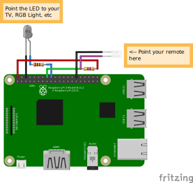

# DIY IR Remote

Create your own infrared remote that you can activate programmatically.

## Getting Started
Look at the examples  in the `examples` folder. `emit.rs` is for using a Raspberry Pi with a 940nm IR LED connected as a remote. `receive.rs` is to decode the signal that an existing remote sends so that you can mimick the behaviour of an existing remote. The examples use a Raspberry Pi, but this library works on anything that Rust works on. See [my example which uses this library on an ESP32-C3](https://github.com/ChocolateLoverRaj/rust-esp32c3-examples/blob/main/ir-remote/src/main.rs).

## Wiring Diagram

## Tested Devices
These signal pulses of these devices should be decoded by the current logic:
- Generic plastic button grid remote (tested 3 different ones, they all use the same protocol)

- A Pioneer Sound System
- A Samsung TV

Let me know if you have a device with a signal that doesn't get decoded and I can help decode it.

## Resources
You can read about these to learn more about IR remotes:
- https://learn.adafruit.com/ir-sensor/ir-remote-signals
- https://learn.sparkfun.com/tutorials/ir-communication
